# Deep Thematic Analysis with Iterative LLM Support

[](https://opensource.org/licenses/MIT)

## 📦 Official Builds

For convenience, you can download our latest pre-built binaries/installer here:

- **macOS (Apple Silicon)**  
  [Download DeTAILS for macOS (.dmg)](https://storage.googleapis.com/details-builds-0625/mac/main/mac-main-1.0.0/DeTAILS-1.0.0-arm64.dmg)

  [Download DeTAILS for macOS (.zip)](https://storage.googleapis.com/details-builds-0625/mac/main/mac-main-1.0.0/zip/darwin/arm64/DeTAILS-darwin-arm64-1.0.0.zip)

- **Windows (x64)**  
  [Download DeTAILS for Windows (Squirrel Installer)](https://storage.googleapis.com/details-builds-0625/windows/main/win-main-1.0.0/squirrel.windows/x64.zip)

  [Download DeTAILS for Windows (.zip)](https://storage.googleapis.com/details-builds-0625/windows/main/win-main-1.0.0/zip/win32/x64/DeTAILS-win32-x64-1.0.0.zip)

- **Linux (x64)**  
  [Download DeTAILS for Linux (deb)](https://storage.googleapis.com/details-builds-0625/linux/main/linux-main-1.0.0/deb/x64/details_1.0.0_amd64.deb)

  [Download DeTAILS for Linux (rpm)](https://storage.googleapis.com/details-builds-0625/linux/main/linux-main-1.0.0/rpm/x64/details-1.0.0-1.x86_64.rpm)

  [Download DeTAILS for Linux (.zip)](https://storage.googleapis.com/details-builds-0625/linux/main/linux-main-1.0.0/zip/linux/x64/DeTAILS-linux-x64-1.0.0.zip)

## ✨ What is this?

`DeTAILS` (Deep Thematic Analysis with Iterative LLM Support) is a sophisticated desktop application designed to assist qualitative researchers in performing reflexive thematic analysis (TA) on large text datasets, such as social media posts from platforms like Reddit. By leveraging local large language models (LLMs), DeTAILS enables researchers to efficiently analyze vast amounts of unstructured data while preserving the interpretive depth and researcher reflexivity inherent in traditional TA. It is built on a modern, privacy-preserving architecture, running entirely on your local machine to ensure data security and confidentiality.

With DeTAILS, researchers can:

- Input research questions and background literature to create a contextual "memory snapshot."
- Load and filter datasets from Reddit.
- Collaboratively code data with AI assistance, refining codes through iterative feedback.
- Review and cluster codes.
- Generate and refine overarching themes with interactive AI support.
- Export structured reports for further analysis or publication.

## 🤔 Why?

DeTAILS addresses the challenges of scaling traditional thematic analysis, offering a researcher-centric tool that balances automation while maintaining human control. Here’s why it stands out:

- **Scalability**: Analyze large datasets that would be impractical to code manually.
- **Efficiency**: Reduce the time and effort required for coding and theme development with LLM assistance.
- **Depth**: Maintain the interpretive richness and reflexivity of qualitative analysis.
- **Privacy & Security**: Keep sensitive data local, with all processing performed on your machine.
- **Flexibility**: Customize the analysis process to align with specific research needs.
- **Transparency**: Interrogate and refine AI suggestions through interactive feedback loops, ensuring trustworthiness.

## 🏗️ Architecture Overview

The application follows a multi-layered architecture designed for modularity and efficient communication:

1.  **💻 UI Layer (Frontend - React + Electron):**

    - Provides the graphical user interface using **React**.
    - Runs within an **Electron** container, enabling desktop integration.
    - Communicates with the backend via **HTTP REST APIs**.
    - Uses **IPC** (Inter-Process Communication) to interact with Electron-specific features.
    - Receives real-time updates from the backend via **WebSocket** messages relayed by Electron through IPC messages.

2.  **⚙️ Backend Layer (FastAPI - Data Modeling Server):**

    - The central hub built with **Python** and **FastAPI**.
    - Exposes **REST APIs** for the frontend (React & Electron).
    - Manages a **WebSocket** endpoint for pushing real-time events to Electron.
    - Orchestrates interactions with various underlying services and data stores.

3.  **🛠️ Services & Data Stores:**

    - **Ollama:** Runs open-source Large Language Models locally.
    - **ChromaDB:** Provides efficient vector storage and similarity search.
    - **ripgrep:** Enables fast text search across files.
    - **Zstandard (zstd):** Used for high-speed data compression/decompression.
    - **SQLite:** Embedded relational database for structured data storage.

4.  **☁️ External Service Connections:**
    - Integrates with **OpenAI** and **Gemini** APIs (optional, via user-provided keys).
    - Uses **Transmission** daemon to download Reddit data via Academic Torrents.

**Communication Flow:**

```mermaid
%%{init:{
  "theme":"base",
  "themeVariables":{
    "background":"#fafafa",
    "primaryColor":"#ffffff",
    "clusterBkg":"#f8f9fa",
    "clusterBorder":"#cccccc",
    "edgeLabelBackground":"#ffffff",
    "lineColor":"#444444",
    "arrowheadColor":"#444444"
  },
  "flowchart":{
    "nodeSpacing":80,
    "rankSpacing":60
  }
}}%%
flowchart LR
  subgraph App["DeTAILS Application"]
    style App fill:#f5f5f5,stroke:#999999,stroke-width:2px,stroke-dasharray:5 5
    direction LR

    subgraph UI["Frontend (React + Electron)"]
      style UI fill:#e3f2fd,stroke:#1976d2,stroke-width:2px
      direction LR

      R["React"]
      E["Electron"]

      R <-. IPC .-> E
    end

    subgraph BE["Backend (Server + Services)"]
      style BE fill:#e8f5e9,stroke:#388e3c,stroke-width:2px
      direction LR

      F["Data Modeling Server"]
      Transmission["Transmission Daemon"]
      Ollama["Ollama (Local LLM)"]
      ripgrep["ripgrep (Text Search)"]
      zstd["zstd (Compression/Decompression)"]
      OpenAI["OpenAI API"]
      Gemini["Gemini API"]

      %% Datastores as cylinders %%
      SQLite[("SQLite Database")]
      ChromaDB[("ChromaDB Vector Store")]
    end

    %% Cross‑cluster interactions %%
    R -->|HTTP REST| F
    E -->|HTTP REST| F
    E -->|Spawns & Manages| F
    E -->|Spawns & Manages| Ollama
    E -->|Spawns & Manages| ChromaDB

    F --> Transmission
    F --> ripgrep
    F --> zstd
    F --> SQLite
    F --> OpenAI
    F --> Gemini
    F --> Ollama
    F --> ChromaDB

    F ==>|WebSocket Push| E
  end
```



## Technology Stack

- **Frontend:** React, Electron, TypeScript, Tailwind CSS
- **Backend:** Python, FastAPI
- **AI/LLM:** Ollama (Local) [[Source Code](https://github.com/ollama/ollama)], OpenAI API, Gemini API, Vertex AI API (Google Cloud)
- **Search:** ChromaDB (Vector) [[Source Code](https://github.com/chroma-core/chroma)], ripgrep (Text) [[Source Code](https://github.com/BurntSushi/ripgrep)]
- **Database:** SQLite
- **Utilities:** Zstandard (Decompression of files) [[Source Code](https://github.com/facebook/zstd)], Transmission (Torrents - Academic Torrents [Primary](https://academictorrents.com/details/1614740ac8c94505e4ecb9d88be8bed7b6afddd4), [Fallback](https://academictorrents.com/details/ba051999301b109eab37d16f027b3f49ade2de13))

## 📁 Folder Structure

```
.
├── frontend/  # React UI & Electron Wrapper
│   ├── electron/  # Electron-specific code (main process, handlers)
│   │   ├── handles/
│   │   ├── templates/
│   │   ├── utils/
│   └── src/ # React application source code
│       ├── components/
│       ├── constants/
│       ├── hooks/
│       ├── pages/
│       ├── reducers/
│       ├── router/
│       ├── styles/
│       ├── types/
│       ├── utility/
│       └── App.tsx     # Main React App component
├── backend/  # Backend services and tools source
│   ├── data_modeling_server/ # Main FastAPI application
│   │   ├── controllers/
│   │   ├── database/
│   │   ├── decorators/
│   │   ├── errors/
│   │   ├── headers/
│   │   ├── middlewares/
│   │   ├── models/
│   │   ├── routes/
│   │   ├── services/ # Integration logic (Transmission, LLMs, etc.)
│   │   ├── utils/
│   │   ├── app_ws.py # Websocket endpoint FastAPI entry point
│   │   ├── app_http.py # HTTP FastAPI entry point
│   │   └── main.py # Main entry point
│   ├── chroma/ # ChromaDB
│   ├── ollama-0.4.2/ # Ollama
│   ├── ripgrep/ # Ripgrep
│   └── zstd/ # Zstandard
├── executables_mac/ # Build scripts to make executables for MacOS
├── executables_linux/ # Build scripts to make executables for Linux
├── executables_windows/ # Build scripts to make executables for Windows
└── README.md
```

## 🔧 Build Instructions

**Important:** Building requires specific prerequisites (languages, compilers, libraries) installed on your system. The provided build scripts assume these are available. Pre-built executables for core backend services need to be built using the build scripts in the `executables_*` directories for convenience. Running `npm run make-*` command in the frontend folder builds the frontend as well as the backend services.

### 1. Frontend (React + Electron)

#### 🔐 Google OAuth Setup (Client JSON File)

DeTAILS reads a single JSON credentials file from GCP to configure OAuth. Follow these steps:

- **Generate your OAuth client credentials**

  - In the [Google Cloud Console → APIs & Services → Credentials](https://console.cloud.google.com/apis/credentials), click **Create Credentials → OAuth client ID**, choose **Desktop application** and fill out the rest of the required information
  - Download the resulting `client-*.json` file.
  - Add the client json file path in the .env file inside frontend folder
  - For builds, explicitly mention the path in `frontend/electron/handles/authentication.js`

- **Prerequisites:** Node.js, npm
- **Steps:**
  ```bash
  cd frontend
  npm install
  ```
- **To Run (Development):**
  ```bash
  npm run dev
  ```
- **To Build Application:**

  ```bash
  # For macOS
  npm run make-mac

  # For Windows
  npm run make-win

  # For Linux
  npm run make-linux
  ```

  _(Output found in `frontend/out`)_

### 2. Backend Services (Build from Source)

#### a) Data Modeling Server (FastAPI)

- **Prerequisites:** Python >= 3.11, `venv` module
- **Steps:**

  ```bash
  cd backend/data_modeling_server

  # Create virtual environment
  # macOS:
  python -m venv .venv
  # Linux
  python -m venv linenv
  # Windows:
  python -m venv winenv

  # Activate virtual environment
  # macOS/Linux:
  source .venv/bin/activate
  # Windows (PowerShell):
  .\winenv\Scripts\Activate.ps1
  # Windows (CMD):
  .\winenv\Scripts\activate.bat

  # Install dependencies (choose correct file)
  pip install -r requirements_mac.txt    # or _linux.txt or _windows.txt

  # To Build Executable:
  pyinstaller main.spec
  # Executable found in ./dist/main (or .\dist\main.exe on Windows)

  # To Run Server Directly (Development):
  python main.py
  ```

#### b) Ripgrep

- **Prerequisites:** Rust, Cargo
- **Steps:**
  ```bash
  cd backend/ripgrep
  cargo build --release --features 'pcre2'
  ```
  _(Executable found in `./target/release/rg`)_

#### c) Zstandard (zstd)

- **Prerequisites (Unix - macOS/Linux):** `make`, `gcc`

  ```bash
  cd backend/zstd
  make
  ```

  _(Executable `zstd` found in `backend/zstd`)_

- **Prerequisites (Windows):** `cmake`, `make` (e.g., MinGW), ensure both are in PATH.
  ```bash
  cd backend/zstd/build/cmake
  mkdir builddir
  cd builddir
  # Using Command Prompt (cmd.exe)
  cmake -G "MinGW Makefiles" ..
  make
  ```
  _(Executable `zstd.exe` found in `.\build\cmake\builddir\programs\`)_

#### d) ChromaDB

- **Prerequisites:** Python >= 3.11, `venv` module
- **Steps:**

  ```bash
  cd backend/chroma

  # Create virtual environment
  # macOS:
  python -m venv env
  # Linux
  python -m venv linenv
  # Windows:
  python -m venv winenv

  # Activate virtual environment
  # macOS:
  source env/bin/activate
  # Linux
   source linenv/bin/activate
  # Windows (PowerShell):
  .\winenv\Scripts\Activate.ps1

  # Install dependencies (choose correct file)
  pip install -r requirements_exe.txt        # For macOS/Linux
  # pip install -r requirements_exe_windows.txt # For Windows

  # Navigate to CLI directory
  cd chromadb/cli

  # To Build Executable:
  pyinstaller cli.spec
  # Executable found in ./dist/cli (or .\dist\cli.exe on Windows)

  # To Run Server Directly (Development):
  # Ensure you are in the backend/chroma directory with venv activated
  cd backend/chroma
  python chromadb/cli/cli.py run --path /path/to/persist/chroma --host <your_ip> --port <port>
  # Example: python chromadb/cli/cli.py run --path ./chroma_data --host 127.0.0.1 --port 8001
  ```

#### e) Ollama

- **Prerequisites:** Go >= 1.23.3, `make`, `gcc`.
  - **NVIDIA GPU (Linux/Windows):** NVIDIA CUDA Toolkit installed.
  - **Windows:** Visual Studio Build Tools (ensure `cl.exe` is in PATH).
  - **macOS (Metal):** No extra GPU requirements needed.
- **Full Instructions:** See Ollama Development Guide: [link](https://github.com/ollama/ollama/blob/d875e99e4639dc07af90b2e3ea0d175e2e692efb/docs/development.md)
- **Steps:**

  ```bash
  cd backend/ollama-0.4.2

  # For macOS:
  ./scripts/build.sh 0.4.2

  # For Linux:
  make -j$(nproc)
  go build -v -x .

  # For Windows (using Git Bash or similar):
  export CGO_ENABLED=1 # or set CGO_ENABLED=1 in CMD
  make -j%NUMBER_OF_PROCESSORS% # Use available cores
  go build -v -x .
  ```

  _(Executable `ollama` or `ollama.exe` found in the root directory - backend/ollama-0.4.2/)_

## ▶️ Running the Application

1. **Run Packaged Application:** After building the application using `npm run make-*`, navigate to the output directory (`frontend/out/...`) and run the generated executable.

## 🤝 Contributing

Contributions are welcome! Please read our [Contributing Guidelines](CONTRIBUTING.md) before submitting pull requests.

## 📄 License

This project is licensed under GPL 3.0 only. It contains two MIT-licensed modules, one Apache 2.0 module (GPL 3.0 is compatible with Apache 2.0’s patent and notice terms), and one GPL 2.0 (or later) module which we relicense under GPL 3.0.

See the [LICENSE](LICENSE.txt) file for details.

---
